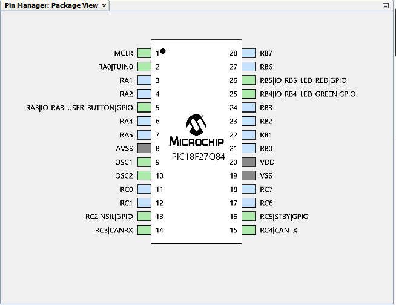

# CANPiController

**CAN** **Pi**c **Controller** a CAN 2.0 B or CAN FD Controller board with the [PIC18F27Q84](https://www.microchip.com/wwwproducts/en/PIC18F27Q84) controller and the [ATA65620](https://www.microchip.com/wwwproducts/en/ATA6560) CAN Transeiver.


This example project showcases the setup and use of the new CAN FD module in CAN 2.0 mode on the PIC18-Q84 family of devices with the CANPiController board.The code periodically transmits CAN frames on a 1 second interval until receiving a specific message (modeled after OBD II), then will respond to certain queries with built-in data.
These examples is the CAN implementation of the CAN FD example of [pic18F57q84-curiosity-nano-CAN-node-mplab-mcc](https://github.com/microchip-pic-avr-examples/pic18F57q84-curiosity-nano-CAN-node-mplab-mcc) from @MicrochipTech

## Related Documentation

- Basic Configuration of the CAN FD Module Technical Brief [(ww1.microchip.com/downloads/en/Appnotes/90003266A.pdf)](https://ww1.microchip.com/downloads/en/Appnotes/90003266A.pdf)
- PIC18F27/47/57Q84 Datasheet [(https://www.microchip.com/wwwproducts/en/PIC18F57Q84)](https://www.microchip.com/wwwproducts/en/PIC18F57Q84)

## Software Used

- MPLAB® X IDE 5.50 or newer [(microchip.com/mplab/mplab-x-ide)](http://www.microchip.com/mplab/mplab-x-ide)
- MPLAB® XC8 2.32 or a newer compiler [(microchip.com/mplab/compilers)](http://www.microchip.com/mplab/compilers)
- MPLAB® Code Configurator (MCC) 3.95.0 or newer [(microchip.com/mplab/mplab-code-configurator)](https://www.microchip.com/mplab/mplab-code-configurator)
- MPLAB® Code Configurator (MCC) Device Libraries PIC10 / PIC12 / PIC16 / PIC18 MCUs 1.81.7 or newer [(microchip.com/mplab/mplab-code-configurator)](https://www.microchip.com/mplab/mplab-code-configurator)
- Microchip PIC18F-Q Series Device Support (1.11.185) or newer [(packs.download.microchip.com/)](https://packs.download.microchip.com/)


## Hardware Used

Hardware Used

- [*KiCAD* project files](https://github.com/gregorsun/CANPiController/tree/main/KiCAD)
- [README](https://github.com/gregorsun/CANPiController/blob/main/KiCAD/README.md) for the CANPiController PCB board

## Setup

The CANPiController Board is used as the development platform. In addition the [CAN BUS analyzer](https://www.microchip.com/developmenttools/productdetails/apgdt002) or any other CAN bus capable analyzer is needed to view the outgoing CAN frames and send incoming CAN frames to the device.


PIN Setup



PIN Manager Grid View


Other Setup is versy similar to the [pic18F57q84-curiosity-nano-CAN-node-mplab-mcc](https://github.com/microchip-pic-avr-examples/pic18F57q84-curiosity-nano-CAN-node-mplab-mcc)

## Changes to the Setup from the CAN FD demo

Main.c
```c

 //enable CAN Transceiver
 NSIL_SetLow();
 STBY_SetLow();
    
```

created interrupt_handler_function.h to put Interrupt handler to a seperate file
```c
/* 
 * File:   interrupt_handler_function.h
 * Author: M43998
 *
 * Created on July 1, 2021, 11:58 AM
 */

#ifndef INTERRUPT_HANDLER_FUNCTION_H
#define	INTERRUPT_HANDLER_FUNCTION_H

#ifdef	__cplusplus
extern "C" {
#endif

void TU16A__C1_TransmitInterruptHandler(void);
void C1__ReceiveFIFO1NotEmptyHandler(void);

#ifdef	__cplusplus
}
#endif

#endif	/* INTERRUPT_HANDLER_FUNCTION_H */
```

interrupt_handler_function.c
- The Universal timer is used for a 1 second "heartbeat" periodic transmission to ensure that the hardware is properly connected and programmed.  This periodic transmission's code is within the Universal Timer 1A's interrupt routine:
- The CAN is set up to interrupt when the receive FIFO is not empty.  The logic for processing and handling incoming messages is placed within this interrupt.
- The CAN_MSG_OBJ has to be set up as CAN message and not as a CAN FD message!

```c
/**
 Interrupt Handler function

  @author
 * Gregor Sunderdiek
    

  @File Name
    interrupt_handler_function.c

  @Summary
    Interrupt function handler for CAn and TU16a, so that MCC does not overide the DefaultInterruptHandler in the tu16a.c
 * TU16A_DefaultInterruptHandler has to be disabled in tu16a.c
 
 change in tua16.c
 * // Set Default Interrupt Handler
    TU16A_SetInterruptHandler(TU16A_C1_TransmitInterruptHandler);
 changes in can1.
 * //CAN1_SetFIFO1NotEmptyHandler(DefaultFIFO1NotEmptyHandler);
    CAN1_SetFIFO1NotEmptyHandler(C1__ReceiveFIFO1NotEmptyHandler);
 * 
*/

#include <xc.h>
#include "interrupt_handler_function.h"
#include "mcc_generated_files/can1.h"
#include "mcc_generated_files/tu16a.h"

void TU16A__C1_TransmitInterruptHandler(void){
    CAN_MSG_OBJ Transmission;
    uint8_t Transmit_Data[8]={0x00,0x11,0x22,0x33,0x44,0x55,0x66,0x77};
    __debug_break();
    Transmission.field.brs=CAN_NON_BRS_MODE;
    Transmission.field.dlc=DLC_8;
    Transmission.field.formatType=CAN_2_0_FORMAT;
    Transmission.field.frameType=CAN_FRAME_DATA;
    Transmission.field.idType=CAN_FRAME_STD;
    Transmission.msgId=0x585;
    Transmission.data=Transmit_Data;
    if(CAN_TX_FIFO_AVAILABLE == (CAN1_TransmitFIFOStatusGet(TXQ) & CAN_TX_FIFO_AVAILABLE))
                {
                    CAN1_Transmit(TXQ, &Transmission);
                }
} // end void TU16A_DefaultInterruptHandler(void)


void C1__ReceiveFIFO1NotEmptyHandler(void){
    TU16ACON0bits.ON = 0;  //stop the periodic heartbeat, go into response mode
    CAN_MSG_OBJ Currently_Processing;
    CAN_MSG_OBJ Return_Message;
    uint8_t data_Out[8];
    uint8_t mode=0;
    uint8_t PID=0;
    uint8_t numBytes=0;
    while(1)
    {
        if(CAN1_ReceivedMessageCountGet() > 0) 
        {
            if(true == CAN1_ReceiveFrom(FIFO1,&Currently_Processing)) //receive the message
            {
                break;
            }
        }
    }
    numBytes=Currently_Processing.data[0];
    mode=Currently_Processing.data[1];
    PID=Currently_Processing.data[2];
    Return_Message.msgId=0x7E;
    Return_Message.field.dlc=8;
    Return_Message.field.brs=CAN_NON_BRS_MODE;
    Return_Message.field.idType=CAN_FRAME_STD;
    Return_Message.field.formatType=CAN_2_0_FORMAT;
    Return_Message.field.frameType=CAN_FRAME_DATA;
    data_Out[1]=mode+0x40;
    data_Out[2]=PID;
    data_Out[7]=0x55; //00h or 55h recommended by SAE standard
    if (mode!=0x01||numBytes!=2)  //only respond with current data and a SAE standard broadcast request with 2 following bytes
    {
        return;
    }
    
    else if (PID==0x00)  //PIDs supported
    {
        data_Out[0]=6;
        data_Out[3]=0x18;  //supports engine load, coolant temp
        data_Out[4]=0x78;  //supports fuel pressure, intake pressure, engine speed, vehicle speed
        data_Out[5]=0x00;
        data_Out[6]=0x00;  //no more supported PIDs
        
    }
    
    else if (PID==0x04) //Engine Load
    {
        data_Out[0]=3;
        data_Out[3]=191; //~75% engine load
        data_Out[4]=0x55;  
        data_Out[5]=0x55;
        data_Out[6]=0x55;  
    }

    else if (PID==0x05) //Coolant Temp
    {
        data_Out[0]=3;
        data_Out[3]=100; //60C
        data_Out[4]=0x55;  
        data_Out[5]=0x55;
        data_Out[6]=0x55; 
    }
    
    else if (PID==0x0A) //Fuel Pressure
    {
        data_Out[0]=3;
        data_Out[3]=150; //450 kPA
        data_Out[4]=0x55;  
        data_Out[5]=0x55;
        data_Out[6]=0x55; 
    }
    
    else if (PID==0x0B) //Intake Pressure
    {
        data_Out[0]=3;
        data_Out[3]=200; //200 kPA
        data_Out[4]=0x55;  
        data_Out[5]=0x55;
        data_Out[6]=0x55; 
    }
    
    else if (PID==0x0C) //Engine Speed
    {
        data_Out[0]=4;
        data_Out[3]=54;    //256A+B/4=3500 RPM
        data_Out[4]=176; 
        data_Out[5]=0x55;
        data_Out[6]=0x55; 
    }
    
    else if (PID==0x0D) //Vehicle Speed
    {
        data_Out[0]=3;
        data_Out[3]=70;  //70 km/h
        data_Out[4]=0x55;  
        data_Out[5]=0x55;
        data_Out[6]=0x55; 
    }
    
    else if (PID==0xFF) //go back to heartbeat mode
    {
        TU16ACON0bits.ON = 1;  //stop the response mode, go into periodic heartbeat
        return;
    }
        Return_Message.data=data_Out; 
        if(CAN_TX_FIFO_AVAILABLE == (CAN1_TransmitFIFOStatusGet(TXQ) & CAN_TX_FIFO_AVAILABLE))
        {
            CAN1_Transmit(TXQ, &Return_Message);
        }
        return;
    

} // end 
```

## Operation

On Power-up, the code will periodically transmit messages 

However, upon receiving a message with the CAN ID of 0x7DF, it will cease the periodic messages and go into response mode.  In this mode it will respond to specific messages, as shown below:


After sending a message with 0xFF in the third data byte while in response mode, the node will return to periodic mode and begin sending periodic messages again.

## Summary

This Demo gives an example of hardware and software setup for a basic CAN node with both periodic and response-driven transmissions, showcasing baud rate setup, message filtering, and RX and TX setup.  


##Debug with MLPAB PICkit4

The PCB connector J3 has not the same connection as the [PICkit4 Debugger](https://www.microchip.com/DevelopmentTools/ProductDetails/PartNO/PG164140)

A cable with soldering with connector is needed to match the PICkit4


with the CANPiController board ICSP Interface J3


PICkit4 Header
| PICkit4       |
| ------------- | 
| 1. VPP/MCLR   |
| 2. VDD        |
| 3. VSS        | 
| 4. PGD        | 
| 5. PGC        | 
| 6. NC         | 

ICSP Header J3 on the CANPIController
| ICSP J3       |
| ------------- |
| 1. MCLR VPP   |
| 2. +5V VDD    |
| 3. ICSPDAT    |
| 4. ICSPCLK    |
| 5. NC         |
| 6. GND        |

Connection from the PICkit4 Header to the ICSP Header J3 on the CANPIController
| PICkit4       | ICSP J3       |
| ------------- | ------------- |
| 1. VPP/MCLR   | 1. MCLR VPP   |
| 2. VDD        | 2. +5V VDD    |
| 3. VSS        | 6. GND        |
| 4. PGD        | 3. ICSPDAT    |
| 5. PGC        | 5. NC         |
| 6. NC         | 4. ICSPCLK    |     


